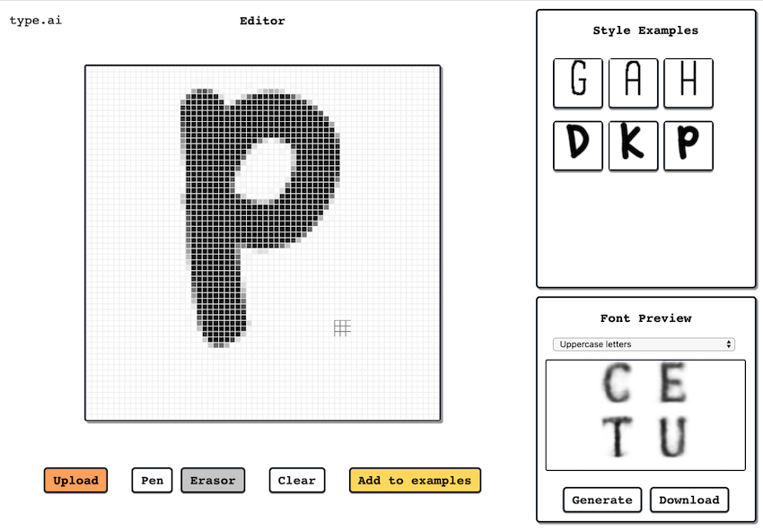

# FONT-NN

Create fonts with the help of a neural network, by giving examples of what you want. 

Live demo hosted on [Github Pages](http://shaunabanana.github.io/font-nn). Or go to [Gitee](http://shaunabanana.gitee.io/font-nn) if you live in China...